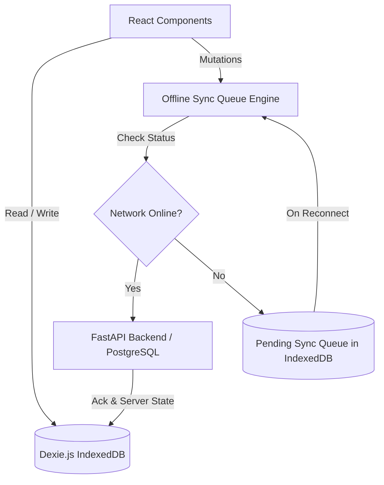

# ReTrails Architecture Guide (Team CurlX)

ReTrails is an offline-first Progressive Web Application (PWA) built for the hackathon by Team CurlX:
- **Backend**: FastAPI, SQLAlchemy 2.0, PostgreSQL (with SQLite fallback), Alembic, Pydantic v2, managed by uv.
- **Frontend**: React, TypeScript, Vite, Tailwind CSS, TanStack Query, React Router, managed by bun.
- **Offline Storage**: Dexie.js (IndexedDB) with synchronization queue and local mutations.
- **PWA Support**: vite-plugin-pwa with service workers and web app manifest.
- **Transactional Emails**: React Email templates rendered to HTML for FastAPI.

---

## Directives

1. **No Emojis & No Jargon**:
   - Do not use emojis anywhere in the codebase, UI text, email templates, documentation, or commit messages.
   - Avoid buzzwords and vague jargon. Keep descriptions direct, precise, and professional.

2. **Package Managers**:
   - Backend: uv (`uv sync`, `uv run ...`)
   - Frontend & Emails: bun (`bun install`, `bun run ...`)

---

## CLI and Package Management Rules

1. **Python / Backend**:
   - Use `uv` for python dependencies and script execution.
   - Install dependencies: `uv sync` or `uv add <package>`
   - Run commands: `uv run uvicorn app.main:app --reload`
   - Run tests: `uv run pytest`

2. **Node / Frontend & Emails**:
   - Use `bun` for frontend and email workspaces.
   - Install dependencies: `bun install` or `bun add <package>`
   - Dev server: `bun run dev`
   - Build: `bun run build`

---

## Offline-First Architecture with Dexie.js

- **Local Reads**: Components read directly from Dexie using `useLiveQuery`.
- **Local Mutations**: User actions write to local Dexie tables and enqueue a change item in `sync_queue`.
- **Sync Reconciliation**: When online, the sync engine drains `sync_queue` to FastAPI endpoints.
