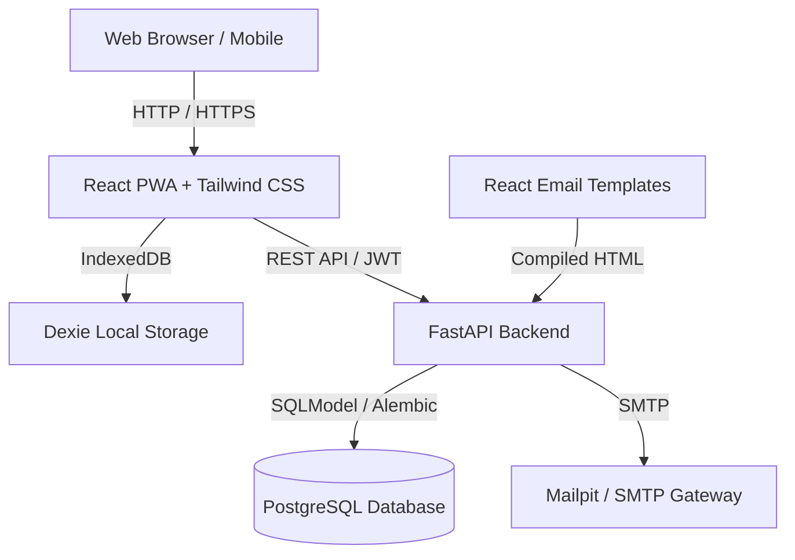

# ReTrails

Full-stack web application developed by Team **CurlX** for the hackathon. Built with FastAPI, SQLModel, React PWA, Dexie, React Email, uv, and bun.

[](https://fastapi.tiangolo.com)
[](https://reactjs.org/)
[](https://tailwindcss.com/)
[](https://react.email/)
[](https://github.com/astral-sh/uv)
[](https://bun.sh/)
[](LICENSE)

---

## Overview

ReTrails is an offline-first, cross-platform application designed to provide reliable data tracking, local persistence, and background cloud synchronization.

- **Team**: CurlX
- **Project**: ReTrails
- **Platform**: Web, Desktop, Mobile (PWA)

---

## Features

- **Package Managers**:
  - Python backend dependencies managed with `uv`.
  - Frontend and email packages managed with `bun`.
- **Backend (FastAPI)**:
  - SQLModel ORM with PostgreSQL and SQLite fallback.
  - Alembic database migrations.
  - JWT authentication and secure password hashing.
  - OpenAPI documentation available at `/docs`.
- **Frontend (React PWA)**:
  - React, TypeScript, and Vite.
  - Tailwind CSS styling.
  - Dexie.js (IndexedDB) for offline-first storage and sync queuing.
  - Progressive Web App support for all client platforms.
- **Emails (React Email)**:
  - Transactional email templates rendered to HTML for SMTP delivery.
  - Preview server for rapid template iteration.
- **Containerization**:
  - Dockerfiles and Docker Compose configuration for PostgreSQL, Mailpit, backend, and frontend services.

---

## Architecture



---

## Project Structure

```text
.
├── backend/                  # FastAPI backend (uv)
│   ├── app/
│   │   └── main.py           # Application entrypoint
│   ├── Dockerfile
│   └── pyproject.toml
├── frontend/                 # React PWA frontend (bun)
│   ├── src/
│   │   ├── App.tsx
│   │   ├── index.css
│   │   └── main.tsx
│   ├── Dockerfile
│   ├── package.json
│   └── vite.config.ts
├── packages/emails/          # React Email templates (bun)
│   ├── emails/
│   ├── package.json
│   └── tsconfig.json
├── docker-compose.yml        # Multi-container orchestration
└── .env.example              # Environment variables template
```

---

## Quickstart

### Prerequisites
- Python 3.10+ and `uv`
- `bun`
- (Optional) Docker and Docker Compose

### 1. Backend Setup (uv)

```bash
cd backend
uv sync
cp ../.env.example .env
uv run uvicorn app.main:app --reload --port 8000
```

### 2. Frontend Setup (bun)

```bash
cd frontend
bun install
bun run dev
```

### 3. Email Preview (bun)

```bash
cd packages/emails
bun install
bun run dev
```

---

## License

MIT (c) 2026 Team CurlX
