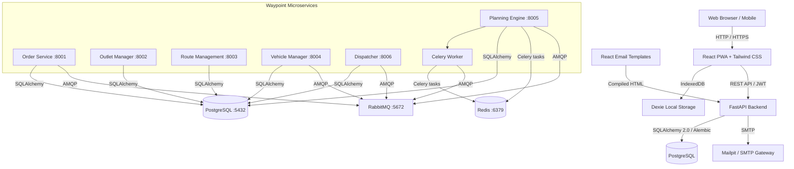

# ReTrails

Full-stack web application developed by Team **CurlX** for the hackathon. Built with FastAPI, SQLAlchemy 2.0, React PWA, Dexie, React Email, uv, and bun.

[](https://fastapi.tiangolo.com)
[](https://reactjs.org/)
[](https://tailwindcss.com/)
[](https://react.email/)
[](https://github.com/astral-sh/uv)
[](https://bun.sh/)
[](LICENSE)

---

## Overview

ReTrails is an offline-first, cross-platform application designed to provide reliable data tracking, local persistence, and background cloud synchronization.

- **Team**: CurlX
- **Project**: ReTrails
- **Platform**: Web, Desktop, Mobile (PWA)

---

## Features

- **Package Managers**:
  - Python backend dependencies managed with `uv`.
  - Frontend and email packages managed with `bun`.
- **Backend (FastAPI)**:
  - SQLAlchemy 2.0 ORM with PostgreSQL and SQLite fallback.
  - Alembic database migrations.
  - JWT authentication and secure password hashing.
  - OpenAPI documentation available at `/docs`.
- **Frontend (React PWA)**:
  - React, TypeScript, and Vite.
  - Tailwind CSS styling.
  - Dexie.js (IndexedDB) for offline-first storage and sync queuing.
  - Progressive Web App support for all client platforms.
- **Emails (React Email)**:
  - Transactional email templates rendered to HTML for SMTP delivery.
  - Preview server for rapid template iteration.
- **Containerization**:
  - Dockerfiles and Docker Compose configuration for PostgreSQL, Mailpit, backend, and frontend services.

---

## Architecture



---

## Project Structure

```text
.
├── backend/                     # Waypoint microservices (uv per-service)
│   ├── order_service/           # Order Service (port 8001)
│   ├── outlet_service/          # Outlet Manager Service (port 8002)
│   ├── route_service/           # Route Management Service (port 8003)
│   ├── vehicle_service/         # Vehicle Manager Service (port 8004)
│   ├── planning_service/        # Planning Engine + Celery Worker (port 8005)
│   ├── dispatch_service/        # Dispatcher Service (port 8006)
│   ├── shared/                  # Shared utilities across services
│   └── helpers/
│       └── init-db.sql          # PostgreSQL multi-database init script
├── frontend/                    # React PWA frontend (bun)
│   ├── src/
│   │   ├── App.tsx
│   │   ├── index.css
│   │   └── main.tsx
│   ├── Dockerfile
│   ├── package.json
│   └── vite.config.ts
├── packages/emails/             # React Email templates (bun)
│   ├── emails/
│   ├── package.json
│   └── tsconfig.json
├── docker-compose.yml           # Waypoint microservices stack
├── docker-compose.dev.yml       # Local dev infrastructure (PostgreSQL, Redis, Mailpit)
└── .env.example                 # Environment variables template
```

---

## Quickstart

### Prerequisites
- Python 3.10+ and `uv` for local backend development
- `bun` for local frontend and email development
- Docker Engine or Docker Desktop with Docker Compose v2 for container deployment

### Fast One-Command Setup & Run

```bash
# 1. Install all dependencies across backend, frontend, and emails:
./dev.sh install

# 2. Start the development environment (Backend + Frontend concurrently):
./dev.sh
```

---

### Individual Service Commands

```bash
# Backend only (FastAPI on port 8000, docs at /docs)
./dev.sh backend

# Frontend only (React on port 5173)
./dev.sh frontend

# Email preview server (React Email on port 3001)
./dev.sh emails

# Run tests
./dev.sh test

# Start dev infrastructure only (PostgreSQL, Redis, Mailpit)
./dev.sh services
./dev.sh services:down
```

### Microservices Stack

Build and run all six Waypoint microservices plus their infrastructure (PostgreSQL,
Redis, RabbitMQ, pgAdmin) from the repository root:

```bash
# Build images and start all services in the background
./dev.sh microservices

# Follow logs across all containers
docker compose logs -f

# Stop and remove containers
./dev.sh microservices:down
```

Port registry when the microservices stack is running:

| Service | URL |
|---|---|
| Order Service | http://localhost:8001 |
| Outlet Manager | http://localhost:8002 |
| Route Management | http://localhost:8003 |
| Vehicle Manager | http://localhost:8004 |
| Planning Engine | http://localhost:8005 |
| Dispatcher | http://localhost:8006 |
| RabbitMQ Management | http://localhost:15672 |
| pgAdmin 4 | http://localhost:5050 |

---

## License

MIT (c) 2026 Team CurlX
