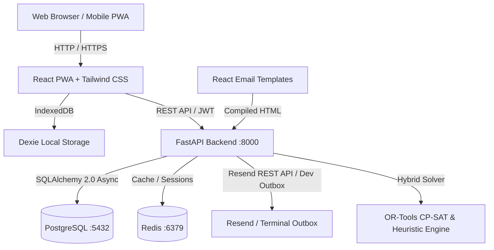

# ReTrails

Full-stack web application developed by Team **CurlX** for the hackathon. Built with FastAPI, SQLAlchemy 2.0, React PWA, Dexie, React Email, Google OR-Tools, uv, and bun.

[](https://fastapi.tiangolo.com)
[](https://reactjs.org/)
[](https://tailwindcss.com/)
[](https://react.email/)
[](https://github.com/astral-sh/uv)
[](https://bun.sh/)
[](LICENSE)

---

## Overview

ReTrails is an offline-first, cross-platform logistics and retail distribution management platform designed to provide reliable order tracking, automated vehicle routing, and local-first persistence with background cloud synchronization.

- **Team**: CurlX
- **Project**: ReTrails
- **Platform**: Web, Desktop, Mobile (PWA)

---

## Features

- **Package Managers**:
  - Python backend dependencies managed with `uv`.
  - Frontend and email packages managed with `bun`.
- **Backend (FastAPI)**:
  - Unified FastAPI application on port 8000.
  - SQLAlchemy 2.0 async ORM with PostgreSQL and SQLite fallback.
  - Hybrid Fleet Allocation Engine with Google OR-Tools CP-SAT and heuristic solvers.
  - Scheduled automated 4:00 PM cutoff allocation runs with concurrency locking.
  - Role-based access control (`system_admin`, `dispatcher`, `loader`, `driver`, `store_manager`).
  - JWT authentication, rate limiting, and password reset flows.
  - OpenAPI documentation available at `/docs`.
- **Frontend (React PWA)**:
  - React 18, TypeScript, and Vite on port 5173.
  - Tailwind CSS 4-tier enterprise responsive design system.
  - Dexie.js (IndexedDB) for offline-first local state and queued background mutations.
  - Interactive distribution maps with Leaflet and live telemetry simulation.
  - Progressive Web App support for mobile field drivers and store managers.
- **Emails (React Email & Resend)**:
  - Transactional email templates rendered to HTML for Resend REST API delivery.
  - Formatted console outbox logging for zero-dependency local development and testing.
  - Preview server on port 3001 for rapid template iteration.
- **Containerization**:
  - `docker-compose.yml`: Full-stack containerized deployment.
  - `docker-compose.dev.yml`: Local dev infrastructure (PostgreSQL, Redis).
  - `docker-compose.prod.yml`: Production HTTPS deployment with Nginx and Let's Encrypt.

---

## Architecture



---

## Project Structure

```text
.
├── backend/                     # Unified FastAPI application (uv)
│   ├── app/
│   │   ├── core/                # Config, database, security, and timezone
│   │   ├── db/                  # Seed scripts and seed data fixtures
│   │   ├── entities/            # SQLAlchemy 2.0 ORM models
│   │   ├── guards/              # Role authorization and rate limiting
│   │   ├── models/              # Domain data structures
│   │   ├── routers/             # API v1 route handlers
│   │   ├── schemas/             # Pydantic v2 validation schemas
│   │   └── services/            # Business logic and Allocation Engine
│   ├── helpers/
│   │   └── init-db.sql          # PostgreSQL database initialization script
│   ├── tests/                   # Backend pytest test suite
│   ├── Dockerfile
│   └── pyproject.toml
├── frontend/                    # React PWA frontend (bun)
│   ├── src/
│   │   ├── api/                 # API client hooks and endpoints
│   │   ├── components/          # UI and shared layout components
│   │   ├── db/                  # Dexie.js offline schema and repositories
│   │   ├── features/            # Feature modules
│   │   ├── pages/               # Enterprise dashboard pages
│   │   └── App.tsx
│   ├── Dockerfile
│   ├── nginx.conf
│   └── package.json
├── packages/emails/             # React Email templates (bun)
│   ├── emails/
│   └── package.json
├── docker-compose.yml           # Full-stack local container deployment
├── docker-compose.dev.yml       # Dev backing infrastructure (PostgreSQL, Redis)
├── docker-compose.prod.yml      # Production HTTPS deployment with Let's Encrypt
└── .env.example                 # Environment variables template
```

---

## Quickstart

### Prerequisites
- Python 3.10+ and `uv` for local backend development
- `bun` for local frontend and email development
- Docker Engine or Docker Desktop with Docker Compose v2 for container deployment

### Fast One-Command Setup & Run

```bash
# 1. Install all dependencies across backend, frontend, and emails:
./dev.sh install

# 2. Start the development environment (Backend + Frontend concurrently):
./dev.sh
```

---

### Individual Service Commands

```bash
# Backend only (FastAPI on port 8000, docs at http://localhost:8000/docs)
./dev.sh backend

# Frontend only (React on port 5173 at http://localhost:5173)
./dev.sh frontend

# Email preview server (React Email on port 3001 at http://localhost:3001)
./dev.sh emails

# Seed database with master data and procedural orders/trips
./dev.sh seed

# Run quality checks (formatting, linting, typechecks, and test suites)
./dev.sh check

# Run tests only
./dev.sh test

# Format code across backend, frontend, and emails
./dev.sh format

# Typecheck code
./dev.sh typecheck

# Start dev infrastructure only (PostgreSQL, Redis)
./dev.sh services
./dev.sh services:down
```

---

### Seeded Enterprise User Accounts

All seeded accounts are configured with the default password: `Password@123`.

| Role | Email | Hub / Location | Employee Code |
|---|---|---|---|
| System Admin | `admin@curlx.tech` | Global | `ADM-001` |
| Dispatcher | `dispatcher.peliyagoda@example.com` | Peliyagoda DC (`PEL`) | `DSP-PEL-001` |
| Dispatcher | `dispatcher.kandy@example.com` | Kandy Hub (`KDY`) | `DSP-KDY-001` |
| Loader | `loader.peliyagoda@example.com` | Peliyagoda DC (`PEL`) | `LDR-PEL-001` |
| Loader | `loader.kandy@example.com` | Kandy Hub (`KDY`) | `LDR-KDY-001` |
| Driver | `driver.peliyagoda@example.com` | Peliyagoda DC (`PEL`) | `DRV-PEL-001` |
| Driver | `driver.kandy@example.com` | Kandy Hub (`KDY`) | `DRV-KDY-001` |
| Store Manager | `store.fresh@example.com` | Colombo Fresh (`OUT001`) | `MGR-FRESH-001` |
| Store Manager | `store.style@example.com` | Kandy City Centre (`OUT081`) | `MGR-STYLE-001` |
| Store Manager | `store.tech@example.com` | Negombo Tech (`OUT106`) | `MGR-TECH-001` |

Manual seeding can also be triggered via the authenticated admin API endpoint: `POST /api/v1/admin/seed` (with optional body `{"reset": true}`).

---

### Docker Deployment

```bash
# Build and start full stack locally in Docker
./dev.sh docker:up

# View logs across all containers
./dev.sh docker:logs

# Stop containers
./dev.sh docker:down
```

Port registry when the stack is running:

| Service | Port / URL | Description |
|---|---|---|
| Frontend Web / PWA | http://localhost:5173 | React Vite Dev Server / Nginx |
| Backend API & Docs | http://localhost:8000/docs | FastAPI Swagger Documentation |
| PostgreSQL | `localhost:5432` | Relational Database (`retrails_db`) |
| Redis | `localhost:6379` | Cache & In-Memory Store |
| Email Preview Server | http://localhost:3001 | React Email Development Server |
| pgAdmin 4 | http://localhost:5050 | PostgreSQL Web Admin |

---

## License

MIT (c) 2026 Team CurlX

