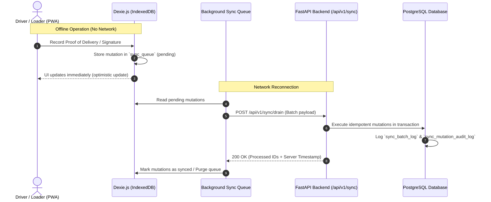

# ReTrails Engineering Roadmap & Feature Specification

Comprehensive project status, feature roadmap, and operational milestones for **ReTrails**, developed by Team **CurlX**.

---

## 1. Executive Summary

ReTrails is an offline-first enterprise logistics and fleet distribution management platform built to solve multi-depot, multi-brand retail supply chain challenges across Western and Central Provinces in Sri Lanka. The platform enforces 7 critical operational feasibility constraints while delivering tailored workflows for 5 enterprise roles.

---

## 2. Enterprise Role Matrix & Status

| Role Code | Role Name | Primary Interface | Offline Capability | Implementation Status |
| :--- | :--- | :--- | :--- | :--- |
| `system_admin` | System Administrator | Web Command Center | Online / Cached | In Progress |
| `dispatcher` | Dispatcher / Planner | Wide Planning Board & 3D Cargo Bay | Partial Cache | In Progress |
| `loader` | Loading Dock Operator | Tablet Bay Station / Scanner | Full Offline (Dexie) | In Progress |
| `driver` | Delivery Driver | Mobile Field PWA | Full Offline (Dexie) | In Progress |
| `store_manager` | Retail Outlet Manager | Store Order & Receipt Portal | Full Offline (Dexie) | Planned |

---

## 3. Core Feature Roadmap by Phase

### Phase 1: Foundation, Security & Database Engine (Completed)
- [x] **PostgreSQL 15+ Canonical Schema**: Complete 21-table schema in `docs/schema/schema.sql` with dynamic views and automated trigger functions.
- [x] **Dual Database Support**: PostgreSQL with automated async SQLite fallback for local development.
- [x] **FastAPI Authentication Service**: JWT token issuance with 8-day token lifespan for field drivers, password reset workflows, and rate limiting guards.
- [x] **Role Canonicalization**: Unified 5-role architecture (`system_admin`, `dispatcher`, `loader`, `driver`, `store_manager`) synchronized across backend models and frontend domain types.
- [x] **Automated Dev Seed Engine**: Automated provisioning of default enterprise accounts (`@curlx.tech`) across all 5 roles.
- [x] **CI/CD Quality Pipeline**: Pre-commit verification scripts (`./dev.sh check`) enforcing Ruff linting, Prettier formatting, TypeScript typechecking, and Pytest coverage.
- [x] **Responsive Layout Foundations**: 4-tier responsive layout system (Wide $\ge 1440\text{px}$, Desktop $1024\text{-}1439\text{px}$, Tablet $600\text{-}1023\text{px}$, Mobile $320\text{-}599\text{px}$).

---

### Phase 2: Authentication & Operational Shells (PR #20 / In Review)
- [x] **Frontend Authentication UI**: Role preset switcher, credential login, password recovery modal, and token reset interface.
- [x] **Non-Blocking Offline Auth State**: Client-side authentication persistence with Dexie.js and local storage caching.
- [x] **Role-Based Routing & Navigation**: Role-guarded route shells and dedicated layouts for Driver, Loader, Dispatcher, and Admin views.
- [x] **Pre-Seeded Mock Data Separation**: Isolated datasets in `frontend/src/data/` preserving presentation components.
- [x] **Graphify Knowledge Graph Sync**: Persistent codebase dependency graph in `graphify-out/graph.json`.

---

### Phase 3: Operational Workflows & Feasibility Engine (Current Focus)
- [ ] **Dispatcher Command Center**:
  - Interactive multi-stop trip planner enforcing single-brand and single-district constraints.
  - 3D Cargo Bay Visualizer enforcing LIFO stacking order and volume/weight capacity caps.
  - Consecutive skip avoidance tracker and immutable deferral audit logging.
- [ ] **Driver Mobile Field PWA**:
  - Turn-by-turn route leg sequencing with live GPS simulation.
  - Digital Proof of Delivery (vector signature capture, geofence coordinate verification, reefer temperature log).
  - Offline mutation queue with background sync batching to `/api/v1/sync/drain`.
- [ ] **Loading Dock Bay Station**:
  - Pre-departure digital barcode scanning and LIFO loading order verification.
  - Dock discrepancy reporting for shortfall or damaged cargo items.

---

### Phase 4: Retail Store & Cold-Chain Telemetry (Upcoming)
- [ ] **Store Manager Portal**:
  - 4:00 PM cutoff order placement with automatic price list resolution.
  - Real-time inbound delivery tracking with live driver ETA estimation.
  - Inbound delivery acceptance and digital handover sign-off.
- [ ] **Cold-Chain Telemetry Alerting**:
  - Real-time GPS telematics monitoring with automatic temperature breach triggers ($> 4.0^\circ\text{C}$ for reefer vehicles).
  - Automated discrepancy generation on telemetry thresholds.

---

### Phase 5: Analytics, Fuel Quotas & Final Hardening (Final Phase)
- [ ] **Fleet Analytics & Sustainability Dashboard**:
  - Weekly fuel quota monitoring and km/l efficiency analytics.
  - Driver safety metrics and on-time delivery performance scoring.
- [ ] **End-to-End Stress & Offline Sync Testing**:
  - Offline network disconnection and bulk reconnection replay tests.
  - High-concurrency database load verification.

---

## 4. Feasibility Rules Compliance Matrix

| Rule ID | Feasibility Constraint | Verification Mechanism | Status |
| :--- | :--- | :--- | :--- |
| **FR-01** | Vehicle Weight & Volume Limits | Pre-dispatch payload calculation (`v_trip_payload_summary`) | In Progress |
| **FR-02** | Brand Separation (Waypoint Fresh / Style / Tech) | Dispatch validation preventing mixed-brand trips | In Progress |
| **FR-03** | Operating Time Budgets (270 min Fresh / 480 min Ambient) | Route leg calculation with dynamic trigger verification | In Progress |
| **FR-04** | Maximum 2 Trips Per Day Per Vehicle | Database unique constraint and dispatch validator | In Progress |
| **FR-05** | Vehicle Home Depot Return Constraint | Leg departure and terminal depot matching checks | In Progress |
| **FR-06** | Outlet Access Limits (Van-Only / Time Windows) | Vehicle classification filter on route assignment | In Progress |
| **FR-07** | Temperature Control (Reefer $\le 4^\circ\text{C}$ vs Ambient) | Reefer vehicle allocation check and telemetry trigger | In Progress |

---

## 5. Offline Sync Protocol Contract



---

## 6. Development & Verification Workflow

All code updates must be validated using the central developer automation script:

```bash
# Run full lint, format, typecheck, and test suite:
./dev.sh check

# Start development servers:
./dev.sh dev

# Update Graphify architecture knowledge graph:
./dev.sh graphify
```
