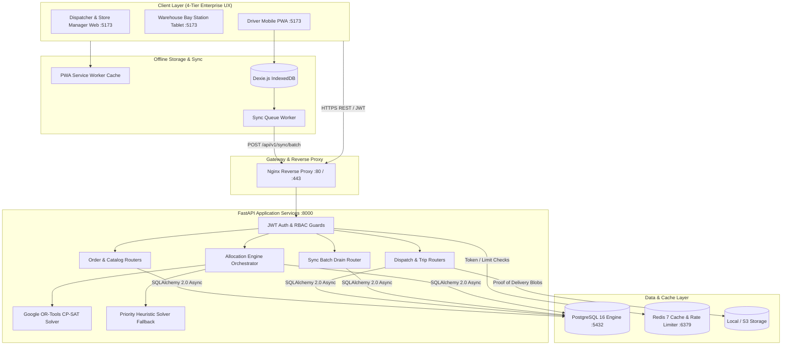

# System Architecture

Delivery planning and execution platform architecture for Waypoint Group by Team CurlX.

---

## 1. Component Architecture Diagram

---

## 2. Component Responsibilities

### 2.1 Frontend Single-Page Application (`frontend/`)
- **Technology**: React 18, TypeScript, Tailwind CSS, Vite, TanStack Query.
- **Responsibilities**:
  - Implements role-segregated user interfaces for Dispatchers, Loaders, Drivers, and Store Managers.
  - Caches server state using TanStack Query for low-latency view rendering.
  - Adheres to the 4-tier responsive layout system across wide desktop, standard desktop, tablet, and mobile viewports.

### 2.2 Offline Sync Engine (`frontend/src/sync/` & `src/db/`)
- **Technology**: Dexie.js (IndexedDB wrapper), Service Worker, custom sync scheduler.
- **Responsibilities**:
  - Persists active route manifests, waypoint items, and offline field mutations (arrivals, POD signatures, discrepancies) on device storage.
  - Automatically intercepts connectivity transitions (`window.online` / `window.offline`).
  - Drains queued mutations in batches of 20 to the backend with client-generated idempotency keys and exponential backoff retry.

### 2.3 Backend API Server (`backend/app/`)
- **Technology**: FastAPI (Python 3.11), Uvicorn ASGI, Pydantic v2 schemas.
- **Responsibilities**:
  - Exposes REST endpoints (`/api/v1/*`) secured with JWT bearer tokens and role-based guards (`require_dispatcher`, `require_loader`, `require_driver`, `require_store_manager`).
  - Validates request payloads with strict Pydantic schemas.
  - Applies depot and outlet tenant isolation so staff can access only authorized locations.

### 2.4 Allocation Engine (`backend/app/services/allocation/`)
- **Technology**: Google OR-Tools 9.10 CP-SAT solver, custom Python priority heuristic.
- **Responsibilities**:
  - Solves the multi-vehicle routing problem subject to hard operational constraints (weight, volume, reefer compatibility, mall low-clearance access, home depot scoping, and 2-trip daily limits).
  - Evaluates multi-objective penalties: minimizing distance, maximizing vehicle cube utilization, and penalizing deferred orders.
  - Automatically generates auditable deferral log records for unallocated orders with distinct reason codes.

### 2.5 Relational Database (`PostgreSQL 16`)
- **Technology**: PostgreSQL 16 with `asyncpg` async driver and SQLAlchemy 2.0 ORM.
- **Responsibilities**:
  - Guarantees ACID transactional integrity across multi-table operations.
  - Enforces domain constraints via database foreign keys, check constraints, and unique indices.
  - Executes database triggers for automatic timestamp tracking, trip metric synchronization, and cold-chain temperature breach logging.

### 2.6 Cache & In-Memory Store (`Redis 7`)
- **Technology**: Redis 7-alpine.
- **Responsibilities**:
  - Token blacklisting and session management.
  - Distributed token-bucket rate limiting for authentication endpoints and general API endpoints.

---

## 3. Key Decisions and Trade-Offs

| Decision | Chosen Approach | Alternative Considered | Rationale & Trade-Off |
|---|---|---|---|
| **Optimization Solver Strategy** | Dual-mode: Google OR-Tools CP-SAT with Heuristic fallback | Pure heuristic or purely commercial external solver (e.g., Gurobi) | OR-Tools CP-SAT delivers mathematically optimal route schedules within 1-2 seconds without external licensing costs. The heuristic fallback guarantees immediate sub-500ms response if constraint bounds are overly tight. |
| **Offline Persistence Architecture** | Local-first IndexedDB via Dexie.js with mutation queue | Online-only REST with local caching | Drivers regularly encounter connectivity dead zones in central Sri Lanka. Local mutation logging with client idempotency UUIDs ensures zero lost signatures or arrival pings without requiring continuous cellular data. |
| **Backend Framework** | FastAPI + SQLAlchemy 2.0 (Async) | Node.js Express / NestJS or Django | FastAPI provides native async concurrency and automatic OpenAPI schema generation. Python is also required to run Google OR-Tools optimization libraries in-process without IPC overhead. |
| **Authentication & RBAC** | Stateless JWT tokens with FastAPI `Depends` role guards | Stateful server-side session cookies | Mobile field PWAs and warehouse tablets operate efficiently with stateless bearer tokens. Redis provides rapid token revocation when needed without adding database query load. |
| **Conflict Handling** | Client idempotency keys with server-side validation | Full operational transform (OT) / CRDTs | Complex CRDTs are unnecessary because field logistics actions belong to isolated driver route legs. Unique idempotency UUIDs cleanly eliminate duplicate requests during network re-establishment. |
