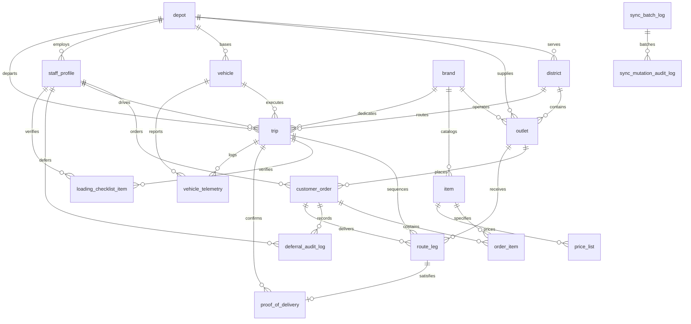

# Data Model

Relational data model specification and dataset mapping for Waypoint Group platform.

---

## 1. Entity-Relationship Diagram

---

## 2. Table Descriptions

| Table Name | Primary Key | Description & Domain Role |
|---|---|---|
| `depot` | `id` (UUID) | Central distribution hubs (Peliyagoda `PEL`, Kandy `KDY`) with geographic coordinates and operating parameters. |
| `district` | `id` (UUID) | Geographic delivery sectors (12 districts across Western and Central provinces) assigned to specific depots. |
| `brand` | `id` (UUID) | The 3 Waypoint Group retail brands (Fresh, Style, Tech) defining cold-chain requirements and daily time budgets. |
| `outlet` | `id` (UUID) | The 120 retail store locations (`OUT001` - `OUT120`) with dock types, parking constraints (`normal`, `van_only`), and delivery windows. |
| `vehicle` | `id` (UUID) | The 60 fleet units with weight capacity (kg), volume capacity (m³), temperature type (`ambient` / `reefer`), vehicle type (`truck` / `van`), and weekly fuel quotas. |
| `staff_profile` | `id` (UUID) | Enterprise staff members linked to authentication users with assigned role, depot, and driver license details. |
| `item` | `id` (UUID) | Master SKU product catalog with packaging units, unit weight, unit volume, and special handling codes (`COL`, `FRG`, `MAL`, `HAZ`). |
| `price_list` | `id` (UUID) | Temporal product pricing table recording effective price intervals in Sri Lankan Rupees (`LKR`). |
| `customer_order` | `id` (UUID) | Replenishment orders placed by store managers with requested dispatch date, priority flag, and status (`pending`, `allocated`, `in_transit`, `delivered`, `deferred`). |
| `order_item` | `id` (UUID) | Individual line items within an order with ordered quantity, locked unit price, computed line weight, and volume. |
| `trip` | `id` (UUID) | Scheduled vehicle delivery run on an operating date, scoped to a single brand, district, and assigned driver (maximum 2 trips per vehicle per day). |
| `route_leg` | `id` (UUID) | Ordered stop sequence within a trip from depot to store outlets, tracking planned arrival and actual arrival timestamps. |
| `loading_checklist_item` | `id` (UUID) | Reverse-sequence (LIFO) pallet verification records completed by warehouse bay loaders prior to dispatch seal approval. |
| `proof_of_delivery` | `id` (UUID) | Signed digital delivery confirmation captured by field drivers, including recipient name, signature image, and timestamp. |
| `discrepancy_report` | `id` (UUID) | Cargo inspection exception records logged during receiving (damaged items, quantity shortages, cold-chain temperature breaches). |
| `deferral_audit_log` | `id` (UUID) | Immutable audit trail recording each unallocated order with specific reason code (`capacity_exceeded`, `time_budget_limit`, `insufficient_reefer`) and dispatcher ID. |
| `vehicle_telemetry` | `id` (UUID) | Real-time GPS location and reefer cargo temperature sensor logs captured during transit. |
| `sync_batch_log` | `id` (UUID) | Server-side audit log of offline mutation batches received from field devices. |

---

## 3. Dataset Mapping to Tables

The competition shared datasets map directly into the relational schema as follows:

| Shared Dataset Source | Target Table(s) | Key Mapped Attributes & Notes |
|---|---|---|
| **Outlets & Locations** (120 stores) | `outlet`, `district`, `depot` | `outlet_id` (`OUT001`-`OUT120`), latitude/longitude coordinates, `dock_type` (`rear_dock`, `street`, `mall_bay`), `parking_constraint` (`van_only`), and operating delivery time windows (`window_open_time`, `window_close_time`). |
| **Fleet & Vehicles** (60 vehicles) | `vehicle` | Registration plate, `weight_cap_kg` (e.g. 1500-5000 kg), `volume_cap_m3` (e.g. 8-24 m³), `type` (`truck` vs `van`), `temp` (`reefer` vs `ambient`), and `weekly_fuel_quota_l`. |
| **Master Item Catalog** | `item`, `brand` | Product SKU, category, name, unit packaging (`Crate`, `Box`, `Carton`, `Kg`), `unit_weight_kg`, `unit_volume_m3`, and special handling flags (`COL` for refrigerated dairy, `FRG`, `HAZ`). |
| **Pricing Schedule** | `price_list` | Unit prices in `LKR`, temporal date validity (`effective_from`, `effective_to`). Locked into `order_item.unit_price` upon order creation via database trigger `fn_auto_lock_order_item_price`. |
| **Distances & Travel Times** | `time_budget.py` reference matrix & `route_leg` | Precomputed transit durations and inter-stop travel minutes between depots (`Peliyagoda`, `Kandy`) and 12 districts, plus dock service allowances per brand. |
| **Store Replenishment Demand** | `customer_order`, `order_item` | Daily store orders with requested order dates, line item quantities, and brand isolation. |
