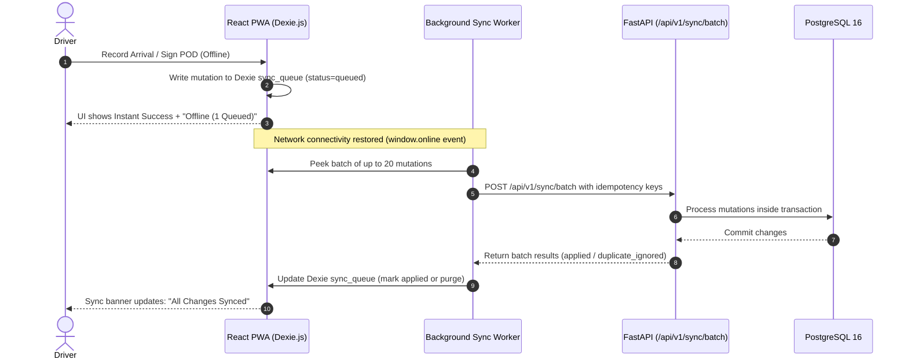

# Offline Architecture and Data Synchronization

Local-first field execution and synchronization architecture for ReTrails by Team CurlX.

---

## 1. What Works Offline

Mobile drivers in central transit and hill-country delivery corridors frequently encounter cellular network loss. ReTrails enables uninterrupted field operation without active network access:

| Capability | Offline Support | Implementation Details |
|---|---|---|
| **View Active Trips & Stops** | Supported | Route manifest, stop order, outlet locations, and contact details are pre-cached in local IndexedDB. |
| **Inspect Manifest Items** | Supported | Order line items, quantities, and handling codes (`COL`, `FRG`) load directly from IndexedDB. |
| **Record Waypoint Arrival** | Supported | Arrival event written to local mutation queue with local UTC timestamp. |
| **Capture Proof of Delivery (POD)** | Supported | Recipient name, digital canvas signature data, and delivery status are stored in local storage. |
| **Log Delivery Discrepancies** | Supported | Shortage quantities, damaged item reasons, and return notes are queued locally. |
| **Log GPS & Sensor Telemetry** | Supported | Coordinate pings and reefer temperature readings are batched in the local telemetry queue. |
| **User Login & Authentication** | Not Supported | Initial login and JWT token issuance require network connectivity to the FastAPI auth server. |

---

## 2. Local Storage Architecture

Client persistence is implemented using **Dexie.js** (an IndexedDB wrapper) under database `retrails-db`:

### IndexedDB Tables
- `trips`: Active and cached historical delivery trips assigned to the driver.
- `route_legs`: Ordered waypoints, arrival timestamps, and destination outlet profiles.
- `orders`: Replenishment orders and cached line items for assigned stops.
- `sync_queue`: The local mutation log storing offline actions awaiting synchronization.

### Mutation Queue Record Schema
Each queued offline action creates an entry in `sync_queue`:

```typescript
interface QueuedMutation {
  idempotency_key: string;       // Client-generated UUID preventing duplicate execution
  entity_type: string;           // 'route_leg' | 'proof_of_delivery' | 'order' | 'telemetry'
  action: string;                // 'arrive' | 'complete_pod' | 'create'
  payload: Record<string, any>;  // Event data (signatures, timestamps, discrepancies)
  client_timestamp: string;      // ISO-8601 UTC timestamp of the offline action
  user_id: string;               // Authenticated user UUID executing the action
  status: 'queued' | 'sent' | 'applied' | 'failed';
  attempts: number;              // Retry attempt counter
  last_error?: string;           // Error message if a previous sync attempt rejected
}
```

---

## 3. Synchronization Flow



1. **Connectivity Detection**: `engine.ts` binds listeners to `window.online` and `window.offline`. The reactive Zustand `useSyncStatus` store immediately reflects connection health in the UI.
2. **Batch Drain**: Upon reconnection or every 60-second polling cycle, `drain.ts` peeks a batch of up to 20 pending mutations and issues a single `POST /api/v1/sync/batch` request.
3. **Server Execution**: The backend router (`app/routers/sync.py`) iterates through the batch, dispatching each mutation to its respective service within a database transaction.
4. **Queue Pruning**: Successfully applied mutations are marked `applied` and removed from Dexie, and `lastSyncAt` is updated.
5. **Retry with Exponential Backoff**: Transient network errors trigger retry attempts with exponential backoff delay up to 5 attempts before marking as failed.

---

## 4. Conflict Handling and Idempotency

- **Idempotency Keys**: Every offline mutation is stamped with a unique client-side UUID (`idempotency_key`). When the server receives an already processed mutation, it safely returns `duplicate_ignored` with HTTP 200/409, preventing double-processing.
- **Single-Writer Domain Scoping**: Field operations (arrival, proof of delivery, cargo inspection) are scoped strictly to a single active trip assigned to a specific driver. Because multiple drivers never concurrently modify the same route leg, field write conflicts are structurally prevented.
- **Server Timestamp Authority**: While the client records `client_timestamp` for local duration tracking, the central PostgreSQL database enforces authoritative UTC timestamps on table updates (`updated_at`), maintaining deterministic audit history.
